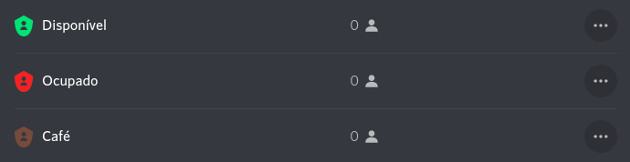

## Primeiros passos

Se você deseja ter o Tinbot em seu servidor Discord, siga as instruções abaixo para que todas as funções do bot sejam ativadas.

### 1. Convide o bot para seu servidor

Clique [aqui](https://discord.com/oauth2/authorize?client_id=791505973591146516&permissions=8&scope=bot) para convidar o bot para seu servidor.

### 2. Crie os cargos necessários para controle de status

Crie os cargos "Disponível", "Ocupado" e "Café" para o controle de status pelo bot, conforme a imagem abaixo (as cores são opcionais):

### 3. Cargo Tinbot

Ao adicionar o Tinbot ao seu servidor, será criado automaticamente o cargo "Tinbot", para que o bot funciona corretamente você deve alterar a ordem dos cargos para que o "Tinbot" esteja primeiro, conforme imagem abaixo:

Adicionar a permissão "Gerenciar cargos" para que o bot possa alterar os cargos dos membros do servidor.

Pronto! Agora você pode usar o bot.

## Comandos

**add-joke**: Adiciona uma nova piada ao banco de dados do Tinbot.

**help**: Mostra a lista de comandos disponíveis do servidor.

**joke**: Mostra uma piada aleatória do banco de dados do Tinbot.

**ping**: Mostra o tempo de resposta do servidor.

**status**: Mostra o status do servidor.

## Duvidas?

Qualquer problema com o bot ou duvidas, você pode entrar em nosso [servidor](https://discord.gg/2KvvqUAeb5) para ficar atualizado sobre o andamento do projeto e conversar comigo.

## Observações

O projeto não possui vinculo com a [Tinbot Robótica](https://tinbot.com.br/) e não é oficial.

## Licença

[MIT](LICENSE)
